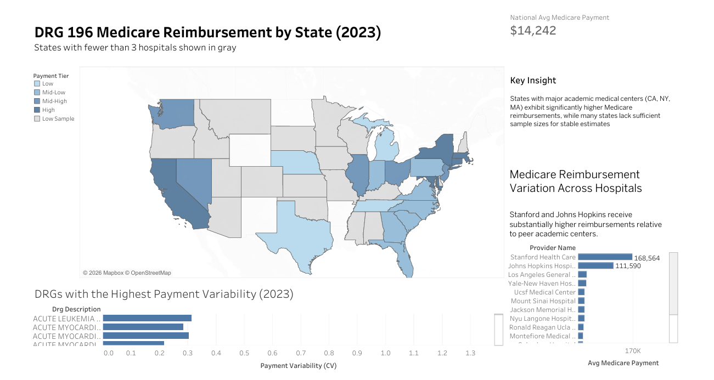

# Medicare Reimbursement Analysis (SQL + Tableau)

## Overview
This project analyzes variation in Medicare reimbursement for DRG 196 across U.S. states and hospitals using CMS inpatient data.

SQL was used to build a structured data pipeline, clean raw healthcare data, and calculate variability metrics such as standard deviation and coefficient of variation.

Tableau was used to create an interactive dashboard highlighting geographic trends and provider-level differences in reimbursement patterns.
## Dashboard Preview

## Key Findings
- States with major academic medical centers, including California, New York, and Massachusetts, show the highest Medicare reimbursements.
- Reimbursement levels vary meaningfully across hospitals, with large academic systems receiving substantially higher payments than peer institutions.
- Several states have low sample sizes, so they were flagged separately to avoid overstating unstable estimates.
- Some DRGs exhibit much higher payment variability than others, based on coefficient of variation and standard deviation.

## Tools Used
- SQL (PostgreSQL)
- Tableau
- Excel

## Data Source
- CMS Medicare Inpatient Hospitals – by Provider and Service (2023)  
  https://data.cms.gov/provider-summary-by-type-of-service/medicare-inpatient-hospitals/medicare-inpatient-hospitals-by-provider

## Project Workflow

### SQL Pipeline
The SQL portion of the project was organized into five stages:

- `01_create_tables.sql`  
  Created the database tables and schema structure for the project.

- `02_import_data.sql`  
  Imported the raw CMS reimbursement data into PostgreSQL.

- `03_clean_data.sql`  
  Cleaned and standardized fields used for downstream analysis.

- `04_exploratory_analysis.sql`  
  Performed exploratory analysis to understand payment distributions and identify relevant patterns.

- `05_variability_analysis.sql`  
  Calculated key metrics such as average payment, hospital counts, standard deviation, and coefficient of variation.

### Tableau Dashboard
The Tableau dashboard includes:
- A state-level choropleth map of DRG 196 Medicare reimbursement
- A hospital-level comparison of high-reimbursement systems
- A DRG-level variability chart using coefficient of variation
- A national average benchmark and summary insight panel

## Why This Project Matters
This project demonstrates an end-to-end data analytics workflow:
- Building and structuring datasets using SQL
- Cleaning and validating real-world healthcare data
- Calculating variability metrics (standard deviation, coefficient of variation)
- Translating findings into a business-focused dashboard

It highlights how reimbursement patterns differ across states and hospital systems, while accounting for low-sample limitations to avoid misleading conclusions.

## Files
- sql/ - SQL pipeline and analysis scripts
- tableau/ - Tableau workbook, exported dashboard, and supporting visuals

## Notes
- States with fewer than 3 hospitals are shown in gray to reduce misleading conclusions from low-sample estimates.
- Coefficient of variation (CV) was used to compare variability across DRGs because it standardizes dispersion relative to the mean.
